ingress多重控制场优化模型
==============

# 课题

- 虚拟现实游戏Ingress中, 多重控制场(Control Field)的最优构造方案探索

# 队伍组成

- 李思涵   无36     2013011187

- 徐安冉   无36     2013011184

- 郭一隆   无36     2013011189

# 背景介绍

## Ingress

- Ingress是由Google Niantic Labs开发的一款**基于GPS定位**的大型多人在线的增强现实游戏, 能在Android & iOS平台运行.

- Ingress面向全球拥有Google Account的用户免费开发注册, 全球有超过700万的玩家(2014.9).

- 在国内, 由于访问Google受限, Ingress知名度并不高, 但在各大城市仍有大量忠实玩家.

- 目前清华活跃Ingress玩家在30人左右.

## 规则介绍

- 全球玩家(agent)被划分为两大阵营(Enlightened&Resistence), agent初次进入游戏时自愿选择阵营(Enlightened俗称绿军, Resistence俗称蓝军).

- 地图上的portal(简称po)为双方争夺的目标, agent可以对portal进行的操作如下表

    | portal归属 |   操作名称  |                             操作效果                             |
    | :--------: | :---------: | :--------------------------------------------------------------: |
    |    所有    |     hack    |                             获得道具                             |
    | 中立, 己方 |    deploy   | 将resonator部署到portal上, 可以capture中立portal, 升级己方portal |
    |    己方    |   recharge  |                         为portal补充能量                         |
    |    己方    | install mod |                 为portal安装模块, 提升portal属性                 |
    |    己方    |     link    |              从当前portal建立一条到其他portal的link              |
    |    敌方    |  use weapon |              攻击敌方portal使其能量衰减, 模块掉落等              |

- portal一般为现实世界中的地标性建筑或雕像等, 如

    + portal 紫荆园食堂: 
    + portal 理学馆: 
    + portal 清华六教: 

- 对po的操作(除recharge)都要求agent的GPS位置在po附近.

- 若3条同一阵营的link构成一个闭合三角形, 则该三角形形成一个该阵营的控制场(Control Field), 每建立一个CF会获得相应的AP(经验), 本课题首要目标是在一定区域内建立field使得agent获得的**AP最大化**.

    + 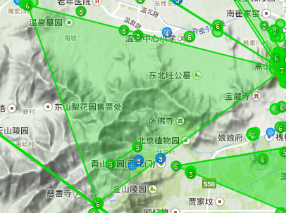

- link和field的建立遵循以下几条规则:

    + agent站在portal A向portal B建立link时, 需耗费portal B的1把key, portal的key通过hack有一定几率获得.

    + 严格在field内的portal不能向其他portal连link, 换言之, field内的po(简称内点)不能作为link的起点, 但可以作为link的终点.

    + 一个portal至多出射8条link, 而入射link数不限.

    + 对于一条新建立的link, 在其左右两侧分别寻找一个面积最大的field, 作为该link形成的field; 也就是说, 1条link至多形成2个field, 左右各1个.

- 多重field概述

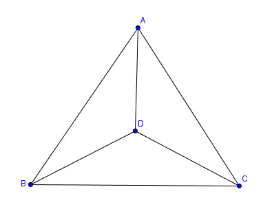

+ 图中共有4个三角形, 在ingress中, 也可以实现构建4个field的link连法.

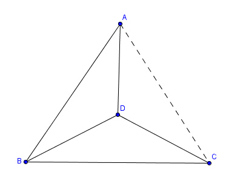

+ 先连成图示形状, 最后连接AC, 则根据上一条中的规则4, 仅能形成3个field: ABD, BCD 和 ABC.

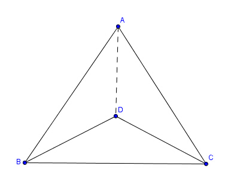 

+ 若连成此图形状, 最后连接AD(A->D, 因为D此时已处在field ABC中, 不能作为link起点), 则将形成4个field, 达到经验最大化目的.

+ 上述情况中, 较小的field叠在较大的field之上, 这种field称为多重field.

## 课题目标

- 在一定区域内, 已知各portal坐标, 寻找多重field建立方案, 使得(按优先级):

    + 经验**最大化**.

    + 由于耗费的总key数是一定的(定理1), 优化使得各portal的key数量**平均化**.

    + 对此区域完成多重field覆盖花费的时间最短(路程短).

- 分别探讨单个agent独立完成多重field构建和多个agent合作完成的情况.

## 研究进展

- 对于经验最大化的方案, 已经有标准成熟而优美的实现方法, 参考文献[1].

- 关于key数目**平均化**的优化, 以及设法减少耗费时间的研究几乎没有.

- 关于多个agent合作, 参考项目[2]有相关算法, 但考虑的因素比较片面.

# 引论

* **假设1.** 研究的问题中，任意三点（portal）不共线。

* **定义1.** 给定点集，各点位置确定，各点连接关系（直线段相连）不同可形成不同的图。边不交叉的图称为无交叉图。（以下提到的图不加说明均为无交叉图）若无交叉图已为完全图，或满足任加一条边即成为交叉图，则称该无交叉图完全。

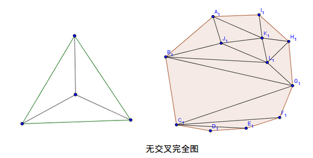

* **定义2.** 给定点集，其凸包顶点称为外点，其余点称为内点。

* **定义3.** 无内点的三角形称为原子三角形。

* **定理1.** 定义在同一点集S上的所有无交叉完全图边数均相等。若`|S|=n`，`S`凸包边界顶点数为`m`，则任意无交叉完全图边数`E=3n-m-3`

* **证明** 由平面直线图的欧拉定理，顶点数为`v`，边数为`e`，区域数为`r`(包括外围的无限大区域)的图满足`v-e+r=2`；在此问题中，`v=n`,`r=2n-m-2+1`，代入得`e=3n-m-3`

* **定义4.** 给定点集`S`，以`S`为顶点集的无交叉图称为`S`的一个划分，其集合记作`Partition(S)`；以`S`为顶点集的有向无交叉图称为`S`上的一个连接方案，其集合记作`Plan(S)`。

* **定义5.** 对于点集`S`的一个完全划分`p`，满足对其任意内点`P0`，均有且仅有3个顶点`P1`,`P2`,`P3`两两相邻且均与P0相邻，且`P0`是三角形`P1P2P3`的内点，则称该划分完美，称`P0`为`P1`,`P2`,`P3`构成的三角形的划分点，该三角形为为P0的外三角形，`P0P1`, `P0P2`, `P0P3`为该三角形的划分边。

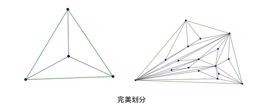

* **定义6.** 对于点集S上的一个连接方案，若其边有序，任意顶点出度8，且对于任意边`ei`，任取排在其之前的三条边，则这三条边或不能构成三角形，或`ei`的起始点不在构成的三角形内，则称其为S上的有效连接方案，其集合记作`ValidPlan(S)`。

* **定义7.** （原子多重）对于`p`属于`ValidPlanS`，若`Degree(p)=4`，p中有且只有一个划分点`d`，且`p`的最后一条边为指向`d`的划分边（称其为入射边），p的倒数第二条边与入射边有公共顶点，则称p为原子多重，称d为多重内点。

* **定义8.** （完美连接方案）对于`p`属于`ValidPlan(S)`，若`p`所对应的划分完美，且所有内点均为多重内点，则称`p`为完美连接方案，或称作完美多重。

* **猜想1.** (4-key猜想)对于任意一个给定的点集`S`，存在有效连接方案`p`，使得`p`完美，且其中任一顶点入度4

  **注**：猜想由来：ingress中建立link需要消耗目标portal的key，而hack相应的portal有几率（大约80%）获得当前portal的key，每次hack至多获得一个key，（在不安装加强包的情况下）两次hack之间冷却时间为5min，同一个portal在4小时之内只能被同一个agent hack四次。因此，若一个方案中（尤其是单agent方案）对某些portal的key需求大于4，则需要额外加强包的开销。
  
* **特例1. (4-key猜想的推翻)** 构造如下图所示点集，内点的分布是上凸的。

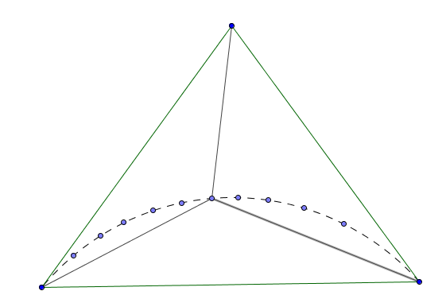

  这种内点的分布使得虚线上任取三个点，其构成的三角形均为原子三角形。为使p完美，虚线上的每个内点均会使上顶点度增加1，否则划分不完美，如下图。

  而猜想1要求上顶点总度数8+4=12，显然当上凸曲线上的内点数>10时，不存在满足条件的p。

* **定理2.** 对于任意给定正整数`N`，总存在一种点集分布`S`，使得若存在有效完美连接方案，则其中至少有一顶点入度`>N`（即N-key猜想不成立）

  **证明：**同特例1，只需使得上凸曲线上的内点数大于N+6

* **猜想2. (完美多重存在猜想)**对于任意一个给定的点集`S`，必存在有效完美连接方案。

* **引理3.1.** 考虑下图所示的完美划分，则这种完美划分对应的完美连接方案应满足：

* **性质3.1.1** 若AD为△ABC的入射边，则AE为△ABD的入射边。（AD与BD对称，AE与BE对称）

  **证明：**假设AE为出射边。

    对于ABCD构成的完美连接方案，AD为入射边。而AE为出射边，因此AE早于AD之前已连成；连成AD之后不能连DE，因此DE早于AD之前已连成。所以连接AD时，△AED不计算在构成的field中，因此该连接方法不是完美连接方案。

* **性质3.1.2** 若DE为△ABD的入射边，则CD为△ABC的入射边。
  **证明：**DE为△ABD的入射边，因此DE的连成晚于AD和BD。所以AD，BD不可能为△ABC的入射边（否则D成为内点，无法射出DE边）。所以CD为△ABC的入射边。

# 模型求解

## 算法实现

### 图论基本算法

图论问题的一些基本算法

+ 叉积

+ 求凸包：采用*Andrew's Monotone Chain*算法，分别求`lower hull`和`upper hull`，整合得到凸包。

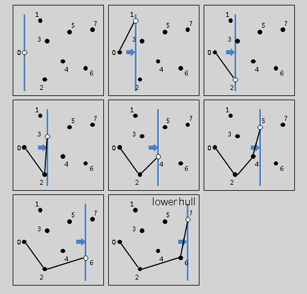
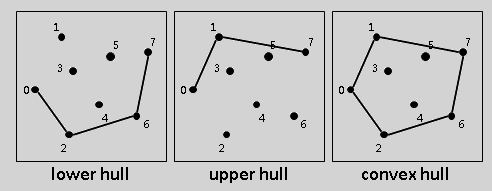

+ 覆盖：利用叉积判断点是否落在某一凸包围成的区域内

+ 凸包三角划分：*Catalan数*递归生成，如图所示，在左右`polygon`递归地划分

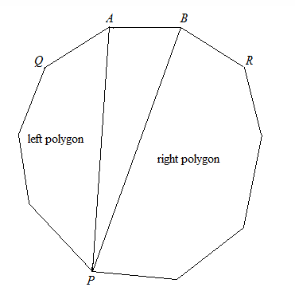

### 递归寻找最优解

**决策变量**：衡量`key`的平均化，优化使得`max(key[i])`取得**最小值**。其中`i`表示第`i`个顶点，根据游戏规则，`key`等价于**顶点入度**。

#### 凸包为三角形的点集

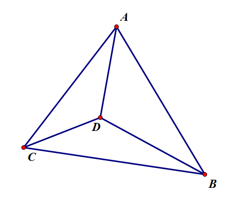

如图，对于完美划分`ABC`，定义：

    f（A,B,C,Ai,Ao,Bi,Bo,Ci,Co）=m
    
式子中`m`表示三角形`ABC`内部顶点以及点`A,B,C`各点入度的**最大值**，其中计算各点入度时**不计外边界`AB,BC,CA`对出入度的贡献**，`Ai，Ao，Bi，Bo，Ci，Co`分别为`A,B,C`的入度和出度。

定义`dAiAk`：

    + `dAiAk = 1`表示有向边`AiAk`的方向为`Ai`指向`Ak`
    
    + `dAiAk = 0`表示有向边`AiAk`的方向为`Ak`指向`Ai`
    
对于三角形ABC中的其中一个内点`D`，有递归式：

    f(A,B,C,Ai,Ao,Bi,Bo,Ci,Co,dAB,dBC,dCA)
    =max{ 
            Ai+dCA+dBA,
            Ci+dAC+dBC,
            Bi+dCB+dAB,
            f(D,B,C,Di1,Do1,Bi1,Bo1,Ci1,Co1,dDB,dBC,dCD),
            f(A,D,C,Ai2,Ao2,Di2,Do2,Ci2,Co2,dAD,dDC,dCA),
            f(A,B,D,Ai3,Ao3,Bi3,Bo3,Di3,Do3,dAB,dBD,dDA),
            Di1+Di2+Di3+dAD+dBD+dCD
        }

**状态转移方程**:

    Ai=Ai2+Ai3+dBA+dDA+dCA+init_in[A];
    Ao=Ao2+Ao3+dAB+dAD+dAC+init_out[A];
    Bi=Bi1+Bi3+dBA+dBD+dBC+init_in[B];
    Bo=Bo1+Bo3+dBA+dBD+dBC+init_out[B];
    Ci=Ci1+Ci2+dBC+dDC+dAC+init_in[C];
    Co=Co1+Co2+dCB+dCD+dCA+init_out[C];
    
其中`init_in, init_out`是三角形`ABC`外部对`ABC`局部带来的初始条件。

在三角形ABC中，对其中每一个顶点，用上式求出`m`，并保存最小`m`的所有解(局部最优解*不唯一*，**必须全部考虑**才能保证达到全局最优解，且全局最优解也不是唯一的)，即为三角形`ABC`中的所有最佳(`key`平均化)完美连接方案。

#### 一般点集的最优解

+ 对于给定点集，求其凸包，并利用*Catalan*算法求出凸包的所有三角划分方法，原点集自然分布在划分出三角形内部(假设1保证无三点共线)

+ 对每个三角形，求出**所有的**最佳完美连接方案。对这些最佳完美连接方案，以**两个三角形相接的边方向必须相同，以及顶点已有的出度**作为约束条件，求出凸包划分中之后一个三角形的所有最佳完美连接方案，直到划分中的所有三角形完成第一步中的递归算法。这样就组合出所有的完美连接方案。（这些完美连接方案已经包含了所有顶点）

**注：**对于两个三角形相接的边方向相同用参数dAiAk来表示，顶点已有出度用init_out表示。

则完美连接方案的最大key需求量：

    M=max{  fi(Ai,Aj,Ak,Aii,Aio,Aji,Ajo,Aki,Ako),
            Apin
            }

**注：** `Ai,Aj,Ak`为凸包进行划分后划分三角形的三个顶点；`Ap`为凸包中的顶点

    Apin=ΣApii-ΣdBkAp

**注：**等式前一项为所有包含`Ap`的三角形中的`Api`之和，后一项中`dBkAp`为包含`Ap`的三角形，包含`Ap`的边是否入射`Ap`

+ 这样求出所有可行的完美连接方案，得到最优解。

### 保证方案可行的算法

+ 注意到游戏有以下规则限制：
    
    1. `link`不能交叉
    
    2. `link`的出射点不能严格在已经建立好的`field`内部
    
    3. 建立一条`link`至多形成两个`field`，分别位于`link`两侧
    
    4. 顶点出度不得大于8
    
+ 在三角形内部递归迭代自然满足规则1：`link`不交叉

+ 递归过程中加入约束即可满足规则4

+ 在构建多重`field`过程中，至关重要的是**最后一条**`link`，它的连接形成了两个`field`，这正是多重`field`形成的`field`数多于“胡乱地连”的关键。如下图，根据规则2：出射点不能在`field`内部，最后一条`link`必为`A->D`，这种可以形成两个`field`的`link`称为`jet_link`。

+ 上述递归算法产生的实际上是有向图，而有效连接方案是**有序有向图**，对于给定有向图，由以下算法可判断其能否生成**有效连接方案**：

    1. 将所有`jet_link`取出并排序，若`jet1`所在的三角形被`jet2`所在三角形覆盖，则`jet1 < jet2`。
    
    2. 以上图为例，在连接`A->D`之前，必须将`BD,CD,BC,AB,AC`全部连接好(无所谓顺序，各边方向由递归优化生成的有向图确定)
    
    3. 在排好序的`jet_link`队列里取出队首元素，记为`jet`
    
    4. 在与`jet`相关的5条边中依次取出一条边，记为`link`，若5条边均已取完，则连接`jet`(加入已连接边的队列)，`jet`出队
    
    5. 若`link`为`jet_link`，重复4-5；否则，连接`link`(加入已连接边的队列)
    
    6. 若`jet_link`队列不空，跳至3
    
    **注** 新边加入已连接边队列时，需判断其出射点是否在已形成的`field`内，若与规则2产生冲突，则说明该有向图不可生成有效连接方案，尝试下一个有向图。
    
+ 经测试，该算法完美地由有向图生成了有效连接方案，测试样例后附。

##算法的弊端及优化

上述算法能够得到理论上的最优解，但其弊端也十分明显，就是时间复杂度极高。程序的运行时间呈指数爆炸式增长，在内点增加到一定程度之后就难以得到结果。因此，必须对以上算法进行一定的优化，在能够满足大部分需求，并能够在大部分情况下得到最优解的条件下大大减少时间复杂度。

### 实现方法
   
   算法优化采用map检索系统，即在原有的递归算法下，加入算过顶点的map，当计算到f(A,B,C,Ai,Bi,Ci)时，若之前已计算过三角形ABC的最优连接方式，则使用之前已计算的连接方式。

代码实现：

# 测试结果及分析

我们对写出的算法程序进行了测试，测试样例为雕塑园各portal实际位置。
我们对现有的算法以及我们的算法进行了比较，可得如下表格：

从表格可以看出，我们的算法能够一次性算出较好的连接方案，而使用随机算法则需要测试大量次数才能得到较好的连接方案，而采用“肩搭肩”的策略得到的连接方案最大key的数量较大，并不是十分好的连接方案，其优点在于agent行动路程较短。
对于agent的行动路程，我们的算法在设计中并没有考虑该因素，对于单个agent行动的方案来说，其行走距离与随机算法得到的方案差别不大，而“肩搭肩”策略得到的连接方案行动路程短。而对于多个agent来说，行走距离大大减少，“肩搭肩”策略在这种情况下完全失去了优越性。
