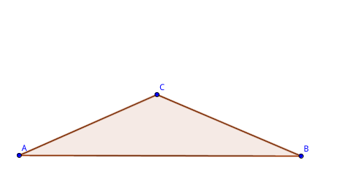

ingress多重控制场优化模型
==============


# 课题

- 虚拟现实游戏Ingress中, 多重控制场(Control Field)的最优构造方案探索


# 队伍组成

- 李思涵   无36     2013011187

- 徐安冉   无36     2013011184

- 郭一隆   无36     2013011189


# 背景介绍

## Ingress

- Ingress是由Google Niantic Labs开发的一款**基于GPS定位**的大型多人在线的增强现实游戏, 能在Android & iOS平台运行.

- Ingress面向全球拥有Google Account的用户免费开发注册, 全球有超过700万的玩家(2014.9).

- 在国内, 由于访问Google受限, Ingress知名度并不高, 但在各大城市仍有大量忠实玩家.

- 目前清华活跃Ingress玩家在30人左右.

## 规则介绍

- 全球玩家(agent)被划分为两大阵营(Enlightened&Resistence), agent初次进入游戏时自愿选择阵营(Enlightened俗称绿军, Resistence俗称蓝军).

- 地图上的portal(简称po)为双方争夺的目标, agent可以对portal进行的操作如下表

    | portal归属 |   操作名称  |                             操作效果                             |
    | :--------: | :---------: | :--------------------------------------------------------------: |
    |    所有    |     hack    |                             获得道具                             |
    | 中立, 己方 |    deploy   | 将resonator部署到portal上, 可以capture中立portal, 升级己方portal |
    |    己方    |   recharge  |                         为portal补充能量                         |
    |    己方    | install mod |                 为portal安装模块, 提升portal属性                 |
    |    己方    |     link    |              从当前portal建立一条到其他portal的link              |
    |    敌方    |  use weapon |              攻击敌方portal使其能量衰减, 模块掉落等              |

- portal一般为现实世界中的地标性建筑或雕像等, 如

    + portal 紫荆园食堂: 
    + portal 理学馆: 
    + portal 清华六教: 

- 对po的操作(除recharge)都要求agent的GPS位置在po附近.

- 若3条同一阵营的link构成一个闭合三角形, 则该三角形形成一个该阵营的控制场(Control Field), 每建立一个CF会获得相应的AP(经验), 本课题首要目标是在一定区域内建立field使得agent获得的**AP最大化**.

    + 

- link和field的建立遵循以下几条规则:

    + agent站在portal A向portal B建立link时, 需耗费portal B的1把key, portal的key通过hack有一定几率获得.

    + 严格在field内的portal不能向其他portal连link, 换言之, field内的po(简称内点)不能作为link的起点, 但可以作为link的终点.

    + 一个portal至多出射8条link, 而入射link数不限.

    + 对于一条新建立的link, 在其左右两侧分别寻找一个面积最大的field, 作为该link形成的field; 也就是说, 1条link至多形成2个field, 左右各1个.

- 多重field概述


+ 图中共有4个三角形, 在ingress中, 也可以实现构建4个field的link连法.


+ 先连成图示形状, 最后连接AC, 则根据上一条中的规则4, 仅能形成3个field: ABD, BCD 和 ABC.

 

+ 若连成此图形状, 最后连接AD(A->D, 因为D此时已处在field ABC中, 不能作为link起点), 则将形成4个field, 达到经验最大化目的.

+ 上述情况中, 较小的field叠在较大的field之上, 这种field称为多重field.


## 课题目标

- 在一定区域内, 已知各portal坐标, 寻找多重field建立方案, 使得(按优先级):

    + 经验**最大化**.

    + 由于耗费的总key数是一定的(定理1), 优化使得各portal的key数量**平均化**.

    + 对此区域完成多重field覆盖花费的时间最短(路程短).

- 分别探讨单个agent独立完成多重field构建和多个agent合作完成的情况.

## 研究进展

- 对于经验最大化的方案, 已经有标准成熟而优美的实现方法, 但有缺陷，参考文献[1].

- 关于key数目**平均化**的优化, 以及设法减少耗费时间的研究几乎没有.

- 关于多个agent合作, 参考项目[2]有相关算法, 但考虑的因素比较片面.


# 引论

* **假设1.** 研究的问题中，任意三点（portal）不共线。

* **定义1.** 给定点集，各点位置确定，各点连接关系（直线段相连）不同可形成不同的图。边不交叉的图称为无交叉图。（以下提到的图不加说明均为无交叉图）若无交叉图已为完全图，或满足任加一条边即成为交叉图，则称该无交叉图完全。


* **定义2.** 给定点集，其凸包顶点称为外点，其余点称为内点。

* **定义3.** 无内点的三角形称为原子三角形。

* **定理1.** 定义在同一点集S上的所有无交叉完全图边数均相等。若`|S|=n`，`S`凸包边界顶点数为`m`，则任意无交叉完全图边数`E=3n-m-3` (参考条目[3])

* **证明** 由平面直线图的欧拉定理，顶点数为`v`，边数为`e`，区域数为`r`(包括外围的无限大区域)的图满足`v-e+r=2`；在此问题中，`v=n`,`r=2n-m-2+1`，代入得`e=3n-m-3`

* **定义4.** 给定点集`S`，以`S`为顶点集的无交叉图称为`S`的一个划分，其集合记作`Partition(S)`；以`S`为顶点集的有向无交叉图称为`S`上的一个连接方案，其集合记作`Plan(S)`。

* **定义5.** 对于点集`S`的一个完全划分`p`，满足对其任意内点`P0`，均有且仅有3个顶点`P1`,`P2`,`P3`两两相邻且均与P0相邻，且`P0`是三角形`P1P2P3`的内点，则称该划分完美，称`P0`为`P1`,`P2`,`P3`构成的三角形的划分点，该三角形为为P0的外三角形，`P0P1`, `P0P2`, `P0P3`为该三角形的划分边。


* **定义6.** 对于点集S上的一个连接方案，若其边有序，任意顶点出度8，且对于任意边`ei`，任取排在其之前的三条边，则这三条边或不能构成三角形，或`ei`的起始点不在构成的三角形内，则称其为S上的有效连接方案，其集合记作`ValidPlan(S)`。

* **定义7.** （原子多重）对于`p`属于`ValidPlanS`，若`Degree(p)=4`，p中有且只有一个划分点`d`，且`p`的最后一条边为指向`d`的划分边（称其为入射边），p的倒数第二条边与入射边有公共顶点，则称p为原子多重，称d为多重内点。

* **定义8.** （完美连接方案）对于`p`属于`ValidPlan(S)`，若`p`所对应的划分完美，且所有内点均为多重内点，则称`p`为完美连接方案，或称作完美多重。

* **猜想1.** (4-key猜想)对于任意一个给定的点集`S`，存在有效连接方案`p`，使得`p`完美，且其中任一顶点入度4

  **注**：猜想由来：ingress中建立link需要消耗目标portal的key，而hack相应的portal有几率（大约80%）获得当前portal的key，每次hack至多获得一个key，（在不安装加强包的情况下）两次hack之间冷却时间为5min，同一个portal在4小时之内只能被同一个agent hack四次。因此，若一个方案中（尤其是单agent方案）对某些portal的key需求大于4，则需要额外加强包的开销。
  
* **特例1. (4-key猜想的推翻)** 构造如下图所示点集，内点的分布是上凸的。


  这种内点的分布使得虚线上任取三个点，其构成的三角形均为原子三角形。为使p完美，虚线上的每个内点均会使上顶点度增加1，否则划分不完美，如下图。


  而猜想1要求上顶点总度数8+4=12，显然当上凸曲线上的内点数>10时，不存在满足条件的p。

* **定理2.** 对于任意给定正整数`N`，总存在一种点集分布`S`，使得若存在有效完美连接方案，则其中至少有一顶点入度`>N`（即N-key猜想不成立）


  **证明：**同特例1，只需使得上凸曲线上的内点数大于N+6

* **猜想2. (完美多重存在猜想)**对于任意一个给定的点集`S`，必存在有效完美连接方案。

* **引理3.1.** 考虑下图所示的完美划分，则这种完美划分对应的完美连接方案应满足：


* **性质3.1.1** 若AD为△ABC的入射边，则AE为△ABD的入射边。（AD与BD对称，AE与BE对称）

  **证明：**假设AE为出射边。

    对于ABCD构成的完美连接方案，AD为入射边。而AE为出射边，因此AE早于AD之前已连成；连成AD之后不能连DE，因此DE早于AD之前已连成。所以连接AD时，△AED不计算在构成的field中，因此该连接方法不是完美连接方案。

* **性质3.1.2** 若DE为△ABD的入射边，则CD为△ABC的入射边。
  **证明：**DE为△ABD的入射边，因此DE的连成晚于AD和BD。所以AD，BD不可能为△ABC的入射边（否则D成为内点，无法射出DE边）。所以CD为△ABC的入射边。


# 模型求解

## 算法实现

### 图论基本算法

图论问题的一些基本算法

+ 叉积

+ 求凸包：采用*Andrew's Monotone Chain*算法，分别求`lower hull`和`upper hull`，整合得到凸包。(参考条目[4])


+ 覆盖：利用叉积判断点是否落在某一凸包围成的区域内

+ 凸包三角划分：*Catalan数*递归生成，如图所示，在左右`polygon`递归地划分


### 递归寻找最优解

**决策变量**：衡量`key`的平均化，优化使得`max(key[i])`取得**最小值**。其中`i`表示第`i`个顶点，根据游戏规则，`key`等价于**顶点入度**。

#### 凸包为三角形的点集


如图，对于完美划分`ABC`，定义：

    f（A,B,C,Ai,Ao,Bi,Bo,Ci,Co）=m
    
式子中`m`表示三角形`ABC`内部顶点以及点`A,B,C`各点入度的**最大值**，其中计算各点入度时**不计外边界`AB,BC,CA`对出入度的贡献**，`Ai，Ao，Bi，Bo，Ci，Co`分别为`A,B,C`的入度和出度。

定义`dAiAk`：

    + `dAiAk = 1`表示有向边`AiAk`的方向为`Ai`指向`Ak`
    
    + `dAiAk = 0`表示有向边`AiAk`的方向为`Ak`指向`Ai`
    
对于三角形ABC中的其中一个内点`D`，有递归式：

    f(A,B,C,Ai,Ao,Bi,Bo,Ci,Co,dAB,dBC,dCA)
    =max{ 
            Ai+dCA+dBA,
            Ci+dAC+dBC,
            Bi+dCB+dAB,
            f(D,B,C,Di1,Do1,Bi1,Bo1,Ci1,Co1,dDB,dBC,dCD),
            f(A,D,C,Ai2,Ao2,Di2,Do2,Ci2,Co2,dAD,dDC,dCA),
            f(A,B,D,Ai3,Ao3,Bi3,Bo3,Di3,Do3,dAB,dBD,dDA),
            Di1+Di2+Di3+dAD+dBD+dCD
        }

**状态转移方程**:

    Ai=Ai2+Ai3+dBA+dDA+dCA+init_in[A];
    Ao=Ao2+Ao3+dAB+dAD+dAC+init_out[A];
    Bi=Bi1+Bi3+dBA+dBD+dBC+init_in[B];
    Bo=Bo1+Bo3+dBA+dBD+dBC+init_out[B];
    Ci=Ci1+Ci2+dBC+dDC+dAC+init_in[C];
    Co=Co1+Co2+dCB+dCD+dCA+init_out[C];
    
其中`init_in, init_out`是三角形`ABC`外部对`ABC`局部带来的初始条件。

在三角形ABC中，对其中每一个顶点，用上式求出`m`，并保存最小`m`的所有解(局部最优解*不唯一*，**必须全部考虑**才能保证达到全局最优解，且全局最优解也不是唯一的)，即为三角形`ABC`中的所有最佳(`key`平均化)完美连接方案。

#### 一般点集的最优解

+ 对于给定点集，求其凸包，并利用*Catalan*算法求出凸包的所有三角划分方法，原点集自然分布在划分出三角形内部(假设1保证无三点共线)

+ 对每个三角形，求出**所有的**最佳完美连接方案。对这些最佳完美连接方案，以**两个三角形相接的边方向必须相同，以及顶点已有的出度**作为约束条件，求出凸包划分中之后一个三角形的所有最佳完美连接方案，直到划分中的所有三角形完成第一步中的递归算法。这样就组合出所有的完美连接方案。（这些完美连接方案已经包含了所有顶点）

**注：**对于两个三角形相接的边方向相同用参数dAiAk来表示，顶点已有出度用init_out表示。

则完美连接方案的最大key需求量：

    M=max{  fi(Ai,Aj,Ak,Aii,Aio,Aji,Ajo,Aki,Ako),
            Apin
            }

**注：** `Ai,Aj,Ak`为凸包进行划分后划分三角形的三个顶点；`Ap`为凸包中的顶点

    Apin=ΣApii-ΣdBkAp

**注：**等式前一项为所有包含`Ap`的三角形中的`Api`之和，后一项中`dBkAp`为包含`Ap`的三角形，包含`Ap`的边是否入射`Ap`

+ 这样求出所有可行的完美连接方案，得到最优解。

### 保证方案可行的算法

+ 注意到游戏有以下规则限制：
    
    1. `link`不能交叉
    
    2. `link`的出射点不能严格在已经建立好的`field`内部
    
    3. 建立一条`link`至多形成两个`field`，分别位于`link`两侧
    
    4. 顶点出度不得大于8
    
+ 在三角形内部递归迭代自然满足规则1：`link`不交叉

+ 递归过程中加入约束即可满足规则4

+ 在构建多重`field`过程中，至关重要的是**最后一条**`link`，它的连接形成了两个`field`，这正是多重`field`形成的`field`数多于“胡乱地连”的关键。如下图，根据规则2：出射点不能在`field`内部，最后一条`link`必为`A->D`，这种可以形成两个`field`的`link`称为`jet_link`。


+ 上述递归算法产生的实际上是有向图，而有效连接方案是**有序有向图**，对于给定有向图，由以下算法可判断其能否生成**有效连接方案**：

    1. 将所有`jet_link`取出并排序，若`jet1`所在的三角形被`jet2`所在三角形覆盖，则`jet1 < jet2`。
    
    2. 以上图为例，在连接`A->D`之前，必须将`BD,CD,BC,AB,AC`全部连接好(无所谓顺序，各边方向由递归优化生成的有向图确定)
    
    3. 在排好序的`jet_link`队列里取出队首元素，记为`jet`
    
    4. 在与`jet`相关的5条边中依次取出一条边，记为`link`，若5条边均已取完，则连接`jet`(加入已连接边的队列)，`jet`出队
    
    5. 若`link`为`jet_link`，重复4-5；否则，连接`link`(加入已连接边的队列)
    
    6. 若`jet_link`队列不空，跳至3
    
    **注** 新边加入已连接边队列时，需判断其出射点是否在已形成的`field`内，若与规则2产生冲突，则说明该有向图不可生成有效连接方案，尝试下一个有向图。
    
+ 经测试，该算法完美地由有向图生成了有效连接方案，测试样例后附。


##算法的弊端及优化

递归优化算法理论上能够得到最优解，但其弊端也十分明显，就是时间复杂度极高，由于**必须保存局部的所有最优解才能保证到达全局最优解**，故需保存和遍历的规模**呈指数爆炸式增长**，在内点增加(实际测试三角形有5个内点已经很难得到结果)到一定程度之后就难以得到结果。因此，必须对以上算法进行一定的优化，在能够满足大部分需求，并能够在大部分情况下以较小的复杂度得到较优解。

### 优化方法
   
+ 局部最优解只保存一个，而不是保存所有，这样的坏处是显然的，有可能无法获得全局最优解，因为某一个特定局部最优解不一定是全局最优解的一部分。

+ 迭代过程增加`map`存取检索，将已经优化过的局部解存入`hash_map`，将指数增长的时间复杂度降低至**多项式时间**。


## 代码实现

采用`python`语言实现

```python
# -*- coding: UTF-8 -*-
# planner.py

from copy import deepcopy
from itertools import product
from random import shuffle
from operator import itemgetter

class Point(object):
    """Point (x, y)"""
    def __init__(self, x, y):
        super(Point, self).__init__()
        self.x = x
        self.y = y

    def __repr__(self):
        return '(%0.0f, %0.0f)' % (self.x, self.y)

    def __str__(self):
        return '(%0.0f, %0.0f)' % (self.x, self.y)

    def __lt__(self, other):
        return self.x < other.x or (self.x == other.x and self.y < other.y)

    def __eq__(self, other):
        if isinstance(other, Point):
            return (self.x == other.x) and (self.y == other.y)
        else:
            return False

    def __ne__(self, other):
        return (not self.__eq__(other))

    def __hash__(self):
        return hash(self.__repr__())

def crossProduct(p0, p1, p2):
    """return vector (p0->p1) cross (p0->p2)"""
    return (p1.x - p0.x) * (p2.y - p0.y) - (p2.x - p0.x) * (p1.y - p0.y)

class PointSet(object):
    """Set {P1, P2, ...}"""
    def __init__(self, point_list):
        super(PointSet, self).__init__()
        self.point_list = point_list
        self.need_update = True

    def __repr__(self):
        return self.point_list.__repr__()

    def __str__(self):
        return self.point_list.__str__()

    def __iter__(self):
        return self.point_list.__iter__()

    def __getitem__(self, index):
        return self.point_list[index]

    @property
    def norm(self):
        return len(self.point_list)

    def sortPoint(self):
        self.point_list.sort()

    def addPoint(self, new_point):
        self.point_list.append(new_point)
        self.need_update = True

    def remove(self, target):
        self.point_list.remove(target)

    @property
    def convex_hull(self):
        """return vertex set of convex hull"""
        if self.need_update:
            # sort by coordinate x
            self.sortPoint()

            lower_hull = []
            # lower hull
            for point in self:
                while (len(lower_hull) >= 2
                        and crossProduct(lower_hull[-2], lower_hull[-1], point) <= 0):
                    lower_hull.pop()
                lower_hull.append(point)

            upper_hull = []
            # upper hull
            for point in self:
                while (len(upper_hull) >= 2
                        and crossProduct(upper_hull[-2], upper_hull[-1], point) >= 0):
                    upper_hull.pop()
                upper_hull.append(point)
            upper_hull.pop(0)
            upper_hull.pop()
            upper_hull.reverse()

            self._convex_hull = ConvexHull(lower_hull + upper_hull)
            self.need_update = False

            self.inner_points = deepcopy(self.point_list)
            for point in self._convex_hull:
                self.inner_points.remove(point)

        return self._convex_hull

    def cover(self, point):
        """return whether point is inside convex hull's coverage"""
        for i in xrange(1, self.convex_hull.norm):
            if crossProduct(point, self.convex_hull[i-1], self.convex_hull[i]) <= 0:
                return False
        return True if crossProduct(point, self.convex_hull[-1], self.convex_hull[0]) > 0 else False

    def divide(self, partition):
        """determine the location of each point under the partition"""
        new_partition = []
        for triangle in partition:
            # IsInstance(triangle, ConvexHull) is True
            if not isinstance(triangle, Triangle):
                triangle = Triangle(triangle.point_list)    # triangle with no inner points
            for point in self.inner_points:
                triangle.addInnerPoints(point)
            new_partition.append(triangle)
        return new_partition

    def findBalanceKeySolution(self):
        partitions = [self.divide(partition) for partition in self.convex_hull.triangulation()]
        solution = {}
        for partition in partitions:
            # print partition
            # raw_input()
            triangle_result_map = {}
            for triangle in partition:
                # print triangle
                # raw_input()
                if triangle not in triangle_result_map:
                    outer_links_set = None
                    init_out = {}
                    init_in = {}
                    for tri in triangle_result_map:
                        result = triangle_result_map[tri]
                        if tri.isNeighbour(triangle):
                            str_dict = {tri.A:'A', tri.B:'B', tri.C:'C'}
                            common_edge = tri.commonEdge(triangle)
                            # print common_edge
                            # print result['links']
                            # raw_input()
                            directed_edge = result['links'][result['links'].index(common_edge)]
                            # print directed_edge
                            # print common_edge
                            outer_links_set = genOuterLinksSet(triangle.getOuterIndex(directed_edge), directed_edge, triangle)
                            init_out = {directed_edge.origin:max(0,result['out_degree_'+str_dict[directed_edge.origin]]-1)}
                            init_in = {directed_edge.target:max(0,result['in_degree_'+str_dict[directed_edge.target]]-1)} 
                            break
                    # if outer_links_set is not None:
                    #     for ele in outer_links_set:
                    #         print ele
                    triangle_result_map[triangle] = triangle.findBalanceKeySolution(outer_links_set=outer_links_set,
                                                                                    init_out=init_out, init_in=init_in)
                # print triangle_result_map
                # raw_input()

            inner_max_key = max([value['key'] for value in triangle_result_map.values()])
            outer_max_key_dict = dict([(vertex, 0) for vertex in self.convex_hull])
            outer_out_degree_dict = dict([(vertex, 0) for vertex in self.convex_hull])
            tmp_links = []
            for triangle, result in triangle_result_map.items():
                tmp_links += result['links']
                # str_dict = {triangle.A:'A', triangle.B:'B', triangle.C:'C'}
                outer_max_key_dict[triangle.A] += result['in_degree_A']
                outer_max_key_dict[triangle.B] += result['in_degree_B']
                outer_max_key_dict[triangle.C] += result['in_degree_C']
                outer_out_degree_dict[triangle.A] += result['out_degree_A']
                outer_out_degree_dict[triangle.B] += result['out_degree_B']
                outer_out_degree_dict[triangle.C] += result['out_degree_C']
                for link in result['links']:
                    if (link.origin in [triangle.A, triangle.B, triangle.C] and
                        link.target in [triangle.A, triangle.B, triangle.C]):
                        # whether link is bound of convex hull
                        i1 = self.convex_hull.point_list.index(link.origin)
                        i2 = self.convex_hull.point_list.index(link.target)
                        if not((abs(i1 - i2) == 1) or (abs(i1 - i2) == self.convex_hull.norm - 1)):
                            outer_max_key_dict[link.target] -= 0.5
                            outer_out_degree_dict[link.origin] -= 0.5
            max_key = max(inner_max_key, max(outer_max_key_dict.values()))
            max_out_degree = max(outer_out_degree_dict.values())
            links = []
            for link in tmp_links:
                if link not in links:
                    links.append(link)
            if max_out_degree > 8:
                max_key = float('inf')
            if solution == {} or max_key <= solution['max_key']:
                solution = {'max_key':max_key, 'max_out_degree':max_out_degree, 'links':links}
        return solution


def genOuterLinksSet(index, link, triangle):
    sets = [[Link(triangle.A, triangle.B), Link(triangle.A, triangle.B, reverse=True)],
            [Link(triangle.B, triangle.C), Link(triangle.B, triangle.C, reverse=True)],
            [Link(triangle.C, triangle.A), Link(triangle.C, triangle.A, reverse=True)]]
    sets[index] = [link]
    # print link
    return product(sets[0], sets[1], sets[2])


class ConvexHull(PointSet):
    def __init__(self, point_list):
        super(ConvexHull, self).__init__(point_list)
        
    def isNeighbour(self, other):
        return len(set(self.point_list).intersection(set(other.point_list))) == 2

    def triangulation(self):
        """return set of [triangle, triangle, ...]"""
        partitions = []
        partition = []
        if self.norm >= 3:
            for i in range(1, self.norm-1):
                middle_part = ConvexHull([self[0], self[i], self[-1]])
                right_part = ConvexHull(self[:i+1])
                left_part = ConvexHull(self[i:])
                if right_part.norm < 3:
                    if left_part.norm < 3:
                        partition.append(middle_part)
                        partitions.append(partition)
                    else:
                        for a in left_part.triangulation():
                            for b in middle_part.triangulation():
                                partitions.append(a + b + partition)
                elif left_part.norm < 3:
                    for a in middle_part.triangulation():
                        for b in right_part.triangulation():
                            partitions.append(a + partition + b)
                else:
                    for a in left_part.triangulation():
                        for b in middle_part.triangulation():
                            for c in right_part.triangulation():
                                partitions.append(a + b + partition + c)
        return partitions

class Triangle(PointSet):
    """a point set whose convex hull is a triangle (ABC), find balance-key solution here"""

    result_map = {}
    
    def __init__(self, point_list, custom=False):
        super(Triangle, self).__init__(point_list)
        if not custom:
            self.A = self.convex_hull[0]
            self.B = self.convex_hull[1]
            self.C = self.convex_hull[2]
        else:
            self.A = point_list[0]
            self.B = point_list[1]
            self.C = point_list[2]

    def __repr__(self):
        return ('\n' + 'outer: ' + [self.A, self.B, self.C].__repr__() + '\n'
                + 'inner: ' + self.inner_points.__repr__())

    def __str__(self):
        return ('\n' + 'outer: ' + [self.A, self.B, self.C].__str__() + '\n'
                + 'inner: ' + self.inner_points.__str__())

    def __eq__(self, other):
        return ((self.A == other.A and self.B == other.B and self.C == other.C)
             or (self.A == other.B and self.B == other.C and self.C == other.A)
             or (self.A == other.C and self.B == other.A and self.C == other.B))

    def __hash__(self):
        return self.A.__hash__() + self.B.__hash__() + self.C.__hash__()

    def addInnerPoints(self, new_point):
        if self.cover(new_point):
            self.point_list.append(new_point)
            self.inner_points.append(new_point)

    def nextVertex(self, vertex):
        if vertex == self.A:
            return self.B
        elif vertex == self.B:
            return self.C
        else:
            return self.A

    def previousVertex(self, vertex):
        if vertex == self.A:
            return self.C
        elif vertex == self.B:
            return self.A
        else:
            return self.B

    def isNeighbour(self, other):
        return len(set([self.A, self.B, self.C]).intersection(set([other.A, other.B, other.C]))) == 2

    def commonEdge(self, other):
        intersection = list(set([self.A, self.B, self.C]).intersection(set([other.A, other.B, other.C])))
        return Link(intersection[0], intersection[1])

    def getOuterIndex(self, link):
        """return index of link in [AB, BC, CA]"""
        if link == Link(self.A, self.B):
            return 0
        elif link == Link(self.B, self.C):
            return 1
        elif link == Link(self.C, self.A):
            return 2
        else:
            return None

    def divideIntoThreeTriangle(self, divider):
        ABD = Triangle([self.A, self.B, divider], custom=True)
        BCD = Triangle([self.B, self.C, divider], custom=True)
        DCA = Triangle([divider, self.C, self.A], custom=True)
        return self.divide([ABD, BCD, DCA])
        
    def findBalanceKeySolution(self, outer_links_set=None, depth=0, init_out={}, init_in={}):
        """return a map
        'key': min(max(degree_in) for all vertices) for all partition, 
        'links'
        'out_degree_A', 'out_degree_B', 'out_degree_C'
        'in_degree_A', 'in_degree_B', 'in_degree_C'
        """
        if outer_links_set == None:
            outer_links_set = product([Link(self.A, self.B), Link(self.A, self.B, reverse=True)],
                                      [Link(self.B, self.C)],
                                      [Link(self.C, self.A), Link(self.C, self.A, reverse=True)])
        result = {}
        if self.norm == 3:
            result = {'key':1, 'links':[],
                    'out_degree_A':0, 'out_degree_B':0, 'out_degree_C':0,
                    'in_degree_A':0, 'in_degree_B':0, 'in_degree_C':0}
            # if depth == 0:
            result['links'] = testFeasibility(list(iter(outer_links_set).next()))[1]
            return result
        # print self
        for outer_links in outer_links_set:
            # print outer_links
            # raw_input()
            # traverse all possible divide point
            for divider in self.inner_points:    # mark divider as 'D'
                # traverse jet link in [A->D, B->D, C->D]
                for jet_point in [self.A, self.B, self.C]:  # mark jet_point as 'A'
                    # traverse direction of BD
                    for d_BD in [0, 1]:     # d_BD == 1 means B->D
                        # traverse direction of CD
                        for d_CD in [0, 1]:     # d_CD == 1 means C->D
                            if jet_point == self.A:
                                AD = Link(self.A, divider, jet_link=True, triangle=self)
                                BD = Link(self.B, divider, 1-d_BD)
                                CD = Link(self.C, divider, 1-d_CD)
                            elif jet_point == self.B:
                                AD = Link(self.A, divider, 1-d_CD)
                                BD = Link(self.B, divider, jet_link=True, triangle=self)
                                CD = Link(self.C, divider, 1-d_BD)
                            else:
                                AD = Link(self.A, divider, 1-d_BD)
                                BD = Link(self.B, divider, 1-d_CD)
                                CD = Link(self.C, divider, jet_link=True, triangle=self)

                            sub_triangles = self.divideIntoThreeTriangle(divider)
                            sub_results = []
                            for triangle in sub_triangles:
                                if triangle.norm == 3:
                                    sub_results.append(triangle.findBalanceKeySolution(depth=depth+1, init_out=init_out, init_in=init_in))
                                elif triangle in Triangle.result_map:
                                    sub_results.append(Triangle.result_map[triangle])
                                else:
                                    index = sub_triangles.index(triangle)
                                    if index == 0:
                                        # print [outer_links[0], BD, AD]
                                        # print triangle
                                        # raw_input()
                                        tmp = triangle.findBalanceKeySolution([[outer_links[0], BD, AD]], depth=depth+1, init_out=init_out, init_in=init_in)
                                    elif index == 1:
                                        tmp = triangle.findBalanceKeySolution([[outer_links[1], CD, BD]], depth=depth+1, init_out=init_out, init_in=init_in)
                                    else:
                                        tmp = triangle.findBalanceKeySolution([[CD, outer_links[2], AD]], depth=depth+1, init_out=init_out, init_in=init_in)
                                    Triangle.result_map[triangle] = tmp
                                    sub_results.append(tmp)
                            tmp_result = {}

                            tmp_result['links'] = sub_results[0]['links'] + sub_results[1]['links'] + sub_results[2]['links']

                            tmp_result['links'] += [AD, BD, CD]
                            tmp_result['out_degree_A'] = sub_results[0]['out_degree_A'] + sub_results[2]['out_degree_C']
                            tmp_result['out_degree_B'] = sub_results[0]['out_degree_B'] + sub_results[1]['out_degree_A']
                            tmp_result['out_degree_C'] = sub_results[1]['out_degree_B'] + sub_results[2]['out_degree_B']
                            tmp_result['in_degree_A'] = sub_results[0]['in_degree_A'] + sub_results[2]['in_degree_C']
                            tmp_result['in_degree_B'] = sub_results[0]['in_degree_B'] + sub_results[1]['in_degree_A']
                            tmp_result['in_degree_C'] = sub_results[1]['in_degree_B'] + sub_results[2]['in_degree_B']

                            if jet_point == self.A:
                                tmp_result['out_degree_A'] += 1
                                tmp_result['out_degree_B'] += d_BD
                                tmp_result['out_degree_C'] += d_CD
                                tmp_result['in_degree_B'] += 1-d_BD
                                tmp_result['in_degree_C'] += 1-d_CD
                            elif jet_point == self.B:
                                tmp_result['out_degree_B'] += 1
                                tmp_result['out_degree_C'] += d_BD
                                tmp_result['out_degree_A'] += d_CD
                                tmp_result['in_degree_C'] += (1-d_BD)
                                tmp_result['in_degree_A'] += (1-d_CD)
                            else:
                                tmp_result['out_degree_C'] += 1
                                tmp_result['out_degree_A'] += d_BD
                                tmp_result['out_degree_B'] += d_CD
                                tmp_result['in_degree_A'] += (1-d_BD)
                                tmp_result['in_degree_B'] += (1-d_CD)

                            in_degree_D = 1 + d_BD + d_CD + sub_results[0]['in_degree_C'] + sub_results[1]['in_degree_C'] + sub_results[2]['in_degree_A']
                            if depth == 0:
                                tmp_result['in_degree_D'] = in_degree_D
                            str_dict = {self.A:'A', self.B:'B', self.C:'C'}
                            actual_out_degrees = {'A':tmp_result['out_degree_A'], 'B':tmp_result['out_degree_B'], 'C':tmp_result['out_degree_C']}
                            actual_in_degrees = {'A':tmp_result['in_degree_A'], 'B':tmp_result['in_degree_B'], 'C':tmp_result['in_degree_C']}
                            for link in outer_links:
                                # print self.A, self.B, self.C
                                # print outer_links
                                # print link
                                # raw_input()
                                actual_out_degrees[str_dict[link.origin]] += 1
                                actual_in_degrees[str_dict[link.target]] += 1
                                # print actual_out_degrees
                                # print actual_in_degrees

                            for point in [self.A, self.B, self.C]:
                                if point in init_out:
                                    actual_out_degrees[str_dict[point]] += init_out[point]
                                if point in init_in:
                                    actual_in_degrees[str_dict[point]] += init_in[point]

                            if depth == 0:
                                # print self
                                for p in str_dict.values():
                                    tmp_result['out_degree_'+p] = actual_out_degrees[p]
                                    tmp_result['in_degree_'+p] = actual_in_degrees[p]

                            tmp_result['key'] = max(max([sub_result['key'] for sub_result in sub_results]), 
                                                max(actual_in_degrees.values()), in_degree_D)

                            if max(actual_out_degrees.values()) > 8:
                                tmp_result['key'] = float('inf')

                            # test feasibility
                            test_result = testFeasibility(tmp_result['links'] + list(outer_links))
                            if not test_result[0]:
                                tmp_result['key'] = float('inf')
                            elif depth == 0:
                                tmp_result['links'] = test_result[1]

                            if result == {} or tmp_result['key'] <= result['key']:
                                result = tmp_result
        return result

def testFeasibility(links):
    jet_links = [link for link in links if link.jet_link]
    jet_links.sort()

    try:
        link_seq = drawOtherLinks(jet_links[0], jet_links, links)
    except NameError:
        return (False, [])
    except IndexError:
        return (True, links)
    return (True, link_seq)

def drawOtherLinks(jet_link, jet_links, links, edges=[]):
    A = jet_link.origin
    D = jet_link.target
    B = jet_link.triangle.nextVertex(A)
    C = jet_link.triangle.previousVertex(A)
    BD = Link(B, D)
    CD = Link(C, D)
    BC = Link(B, C)
    AB = Link(A, B)
    AC = Link(A, C)
    seq = [edge for edge in [BD, CD, BC, AB, AC] if edge not in edges]
    can_link = []
    for edge in seq:
        for link in links:
            if edge == link:
                edge = link
        # find triangle
        # get all vertices
        vertices = []
        for ele in edges + can_link:
            vertices.append(ele.origin)
            vertices.append(ele.target)
        vertices = {}.fromkeys(vertices).keys()

        for ele in edges + can_link:
            for vertex in vertices:
                if Link(ele.origin, vertex) in edges + can_link and Link(ele.target, vertex) in edges + can_link:
                    # find a triangle
                    if Triangle([ele.origin, ele.target, vertex]).cover(edge.origin):
                        # origin inside an existing triangle
                        raise NameError('Inside an existing field!')

        if edge in jet_links:
            return (drawOtherLinks(edge, jet_links, links, edges + can_link))
        else:
            # can link
            can_link.append(edge)
    jet_links.remove(jet_link)
    if jet_links != []:
        return drawOtherLinks(jet_links[0], jet_links, links, edges + can_link + [jet_link])
    else:
        return edges + can_link + [jet_link]


class Link(object):
    """link from origin to target"""
    def __init__(self, origin, target, reverse=False, jet_link=False, triangle=None):
        super(Link, self).__init__()
        self.origin = origin if not reverse else target
        self.target = target if not reverse else origin
        self.jet_link = jet_link
        self.triangle = triangle

    def __repr__(self):
        return self.origin.__repr__() + '->' + self.target.__str__()

    def __str__(self):
        return self.origin.__str__() + '->' + self.target.__str__()

    def __eq__(self, other):
        return ((self.origin == other.origin and self.target == other.target)
                or (self.origin == other.target and self.target == other.origin))

    def __lt__(self, other):
        if self.jet_link and other.jet_link:
            if other.triangle.cover(self.origin):
                return -1
            elif self.triangle.cover(other.origin):
                return 1
            else:
                return 0
        return 0

    def __hash__(self):
        return self.origin.__hash__() + self.target.__hash__()


if __name__ == '__main__':
    # s = PointSet([Point(0,0), Point(30,0), Point(40,30), Point(20,50), Point(10,20), Point(20,10),
    #               Point(8,7), Point(15,9), Point(10,30), Point(10,1), Point(28,28)])
    s = PointSet([Point(40009746,116325990), Point(40009195,116326570), Point(40009154,116327023), 
                  Point(40008720,116325757), Point(40008616,116325533), Point(40008519,116326469), 
                  Point(40008455,116325360), Point(40008396,116325855), Point(40008393,116326263), 
                  Point(40008239,116325485), Point(40008224,116326805), Point(40008151,116327164), 
                  Point(40008131,116326011), Point(40008129,116326349), Point(40008102,116326605), 
                  Point(40008082,116325288), Point(40008077,116324930), Point(40008034,116325578), 
                  Point(40008006,116326991), Point(40008008,116327477), Point(40007854,116324331), 
                  Point(40007761,116324901)])
    # s = PointSet([Point(0,0), Point(4,4), Point(4,0), Point(0,4), Point(1,2)])
    solution = s.findBalanceKeySolution()
    print solution
    print 
    i = 0
    for link in solution['links']:
        print i, ': ', link
        i += 1
    # t = Triangle([Point(0,0), Point(10,30), Point(30,0), Point(20,10), Point(8,7), Point(15,9), Point(10,1),
    #               Point(5,10), Point(20,5), Point(21,4), Point(11,13), Point(13,3)])
    # t = Triangle([Point(0,0), Point(10,30), Point(30,0), Point(10,10), Point(5,3), Point(20,4)])
    # t = Triangle([Point(0,0), Point(10,30), Point(30,0), Point(10,10), Point(5,10)])
    # t = Triangle([Point(0,0), Point(4,0), Point(0,4), Point(1,2)])
    # print t
    # result = t.findBalanceKeySolution(init_out={Point(0,0):4})
    # print result
    # print 
    # i = 0
    # for link in result['links']:
    #     print i, ': ', link
    #     i += 1
    
```


## 方案有效性的判断及评价

### 有效性判断

#### link 不交叉

```python
def ccw(a, b, c):
    return (c.y - a.y) * (b.x - a.x) > (b.y - a.y) * (c.x - a.x)

class Link(object):
    # …
    def intersect(self, other):
        if ({self.in_po, self.out_po} &
            {other.in_po, other.out_po}):
            return False  # Share a portal.

        return (ccw(self.out_po, other.out_po, other.in_po) !=
                ccw(self.in_po, other.out_po, other.in_po) and
                ccw(self.out_po, self.in_po, other.out_po) !=
                ccw(self.out_po, self.in_po, other.in_po))
    # …
```

+ 验证结果与理论预测相符，迭代过程自然保证了`link`不交叉

#### 不能从 field 里出射

在每个 field 形成时，标记其盖住的 portal。

具体实现方式则是，将每个 portal 的坐标转换为新 field 下的质心坐标，若坐标各分量均大于 0
则说明该 portal 在该 field 内。核心代码如下：

```python
class Link(object):
    # …
    def contains(self, portal):
        """Check whether a portal is inside this field"""
        # Using barycentric coordinates.
        # Algorithm from http://stackoverflow.com/questions/2049582/
        #                how-to-determine-a-point-in-a-triangle.
        # Thanks Andreas Brinck & andreasdr.
        apexes = self.apexes

        s = 1 / (2 * self.signed_area) * (
            portal.x * (apexes[2].y - apexes[0].y) +
            apexes[0].x * (portal.y - apexes[2].y) +
            apexes[2].x * (apexes[0].y - portal.y))

        t = 1 / (2 * self.signed_area) * (
            portal.x * (apexes[0].y - apexes[1].y) +
            apexes[0].x * (apexes[1].y - portal.y) +
            apexes[1].x * (portal.y - apexes[0].y))

        return s > 0 and t > 0 and 1 - s - t > 0

    # …
```

+ 验证结果与预期相符，保证方案可行的算法保证了不从`field`内部出射。

#### 出度小于等于 8

+ 迭代过程中一旦出度超过8，将`max_key`置为正无穷，即表示不可行，自然被筛选掉。


### 评价

#### AP

在 link 时更新，link 中存有 link 和该 link 形成的 field 的总 AP

**注** 游戏中`link +313AP`，`field +1250AP`

测试样例如下(紫荆雕塑园，共22个`portal`，凸包为五边形)

```
<link from 4 to 5, 313 AP>,
<link from 5 to 7, 313 AP>,
<link from 4 to 7, 1563 AP>,
<link from 2 to 4, 313 AP>,
<link from 2 to 7, 1563 AP>,
<link from 1 to 2, 313 AP>,
<link from 7 to 1, 1563 AP>,
<link from 1 to 4, 2813 AP>,
<link from 1 to 5, 2813 AP>,
<link from 7 to 3, 313 AP>,
<link from 3 to 1, 1563 AP>,
<link from 3 to 2, 2813 AP>,
<link from 16 to 10, 313 AP>,
<link from 10 to 7, 313 AP>,
<link from 7 to 16, 1563 AP>,
<link from 16 to 3, 1563 AP>,
<link from 3 to 10, 2813 AP>,
<link from 8 to 16, 313 AP>,
<link from 3 to 8, 1563 AP>,
<link from 1 to 22, 313 AP>,
<link from 3 to 22, 1563 AP>,
<link from 22 to 7, 2813 AP>,
<link from 22 to 16, 2813 AP>,
<link from 22 to 8, 2813 AP>,
<link from 22 to 17, 313 AP>,
<link from 21 to 17, 313 AP>,
<link from 22 to 21, 1563 AP>,
<link from 1 to 21, 1563 AP>,
<link from 1 to 17, 2813 AP>,
<link from 20 to 15, 313 AP>,
<link from 15 to 18, 313 AP>,
<link from 20 to 18, 1563 AP>,
<link from 20 to 12, 313 AP>,
<link from 18 to 12, 1563 AP>,
<link from 12 to 15, 2813 AP>,
<link from 9 to 13, 313 AP>,
<link from 13 to 14, 313 AP>,
<link from 14 to 9, 1563 AP>,
<link from 9 to 18, 313 AP>,
<link from 18 to 14, 1563 AP>,
<link from 18 to 13, 2813 AP>,
<link from 11 to 14, 313 AP>,
<link from 9 to 11, 1563 AP>,
<link from 9 to 12, 1563 AP>,
<link from 12 to 14, 2813 AP>,
<link from 12 to 11, 2813 AP>,
<link from 20 to 6, 313 AP>,
<link from 18 to 6, 1563 AP>,
<link from 6 to 12, 2813 AP>,
<link from 6 to 9, 2813 AP>,
<link from 18 to 19, 313 AP>,
<link from 19 to 20, 1563 AP>,
<link from 6 to 22, 313 AP>,
<link from 22 to 20, 1563 AP>,
<link from 22 to 18, 2813 AP>,
<link from 22 to 19, 2813 AP>,
<link from 20 to 3, 1563 AP>,
<link from 3 to 6, 2813 AP>
```

#### 行走距离

    总距离 = 连接方案中依次连接每条 link 出射 portal 的路径的长度
    
+ 生成的紫荆雕塑园方案估算行走距离大约为5.5km，符合直观与经验

### 多人规划

由于算法的性质，最后得到的连接方案本身就有**聚集**的性质，即相近的 link 在连接方案中也相近。

故 n 人规划时，以平均化 AP 为目标，将连接方案分成 AP 相近的几个块，从而达到多人规划的目的。

如3人规划紫荆雕塑园，共58条`link`，0号agent连接0~21号`link`, 1号agent连接22~42，2号agent连接43~57，三人分别获得经验29386,27823,28445，较为平均。

+ 可能改进：可生成一张经验获得地图，即在给定方案下，可在给定点集上标出各点能获得的经验值，对地图进行区域划分，大致分为经验平均的若干区域，供多个agent合作，这样形成的方案各agent行走距离较小，效率高，但图形划分的实现较为困难。

## 测试结果及分析

我们对写出的算法程序进行了测试，测试样例为雕塑园各portal实际位置。
我们对现有的算法以及我们的算法进行了比较，可得如下表格：

|算法|max-field算法|肩搭肩策略|我们的算法|
|:--:|:--:|:----:|:----:|
|max_key|平均6左右|8|5|
|运行时间|平均每次运算1min|/|10min|
|行走距离|平均5km|2km|5.5km|
|3 agent|平均2km|2km|1.4km|

+ 从表格可以看出，我们的算法能够一次性算出较好的连接方案，而使用`max-field`随机算法(参考条目[2])则需要**测试大量次数**才能得到较好的连接方案(其最优的方案可达到4-key)，而采用“肩搭肩”的策略(参考条目[1])得到的连接方案最大key的数量较大，并不是十分好的连接方案，而且当某一三角形内点超过8时，“肩搭肩”策略会因与规则4冲突而**无法实施**，其优点在于agent行动路程较短。

+ 对于agent的行动路程，我们的算法在设计中并没有考虑该因素，对于单个agent行动的方案来说，其行走距离与随机算法得到的方案差别不大，而“肩搭肩”策略得到的连接方案行动路程短。而对于多个agent来说，行走距离大大减少，“肩搭肩”策略在这种情况下完全失去了优越性。

+ 附“肩搭肩”策略示意图




#### 附：雕塑园最终方案

```
0 :  (40008008, 116327477)->(40008102, 116326605)
1 :  (40008102, 116326605)->(40008034, 116325578)
2 :  (40008008, 116327477)->(40008034, 116325578)
3 :  (40008008, 116327477)->(40008151, 116327164)
4 :  (40008034, 116325578)->(40008151, 116327164)
5 :  (40008151, 116327164)->(40008102, 116326605)
6 :  (40008393, 116326263)->(40008131, 116326011)
7 :  (40008131, 116326011)->(40008129, 116326349)
8 :  (40008129, 116326349)->(40008393, 116326263)
9 :  (40008393, 116326263)->(40008034, 116325578)
10 :  (40008034, 116325578)->(40008129, 116326349)
11 :  (40008034, 116325578)->(40008131, 116326011)
12 :  (40008224, 116326805)->(40008129, 116326349)
13 :  (40008393, 116326263)->(40008224, 116326805)
14 :  (40008393, 116326263)->(40008151, 116327164)
15 :  (40008151, 116327164)->(40008129, 116326349)
16 :  (40008151, 116327164)->(40008224, 116326805)
17 :  (40008008, 116327477)->(40008519, 116326469)
18 :  (40008034, 116325578)->(40008519, 116326469)
19 :  (40008519, 116326469)->(40008151, 116327164)
20 :  (40008519, 116326469)->(40008393, 116326263)
21 :  (40008034, 116325578)->(40008006, 116326991)
22 :  (40008006, 116326991)->(40008008, 116327477)
23 :  (40008519, 116326469)->(40009154, 116327023)
24 :  (40009154, 116327023)->(40008008, 116327477)
25 :  (40009154, 116327023)->(40007761, 116324901)
26 :  (40008008, 116327477)->(40007761, 116324901)
27 :  (40007761, 116324901)->(40008519, 116326469)
28 :  (40007761, 116324901)->(40008034, 116325578)
29 :  (40007761, 116324901)->(40008006, 116326991)
30 :  (40008720, 116325757)->(40008616, 116325533)
31 :  (40008616, 116325533)->(40007854, 116324331)
32 :  (40007854, 116324331)->(40008720, 116325757)
33 :  (40008720, 116325757)->(40009195, 116326570)
34 :  (40007854, 116324331)->(40009195, 116326570)
35 :  (40009195, 116326570)->(40009746, 116325990)
36 :  (40009746, 116325990)->(40007854, 116324331)
37 :  (40009746, 116325990)->(40008720, 116325757)
38 :  (40009746, 116325990)->(40008616, 116325533)
39 :  (40009195, 116326570)->(40008455, 116325360)
40 :  (40008455, 116325360)->(40009154, 116327023)
41 :  (40007854, 116324331)->(40009154, 116327023)
42 :  (40009746, 116325990)->(40009154, 116327023)
43 :  (40009154, 116327023)->(40009195, 116326570)
44 :  (40007854, 116324331)->(40008455, 116325360)
45 :  (40008082, 116325288)->(40008239, 116325485)
46 :  (40007761, 116324901)->(40008082, 116325288)
47 :  (40007761, 116324901)->(40008239, 116325485)
48 :  (40008239, 116325485)->(40007854, 116324331)
49 :  (40007761, 116324901)->(40007854, 116324331)
50 :  (40007854, 116324331)->(40008082, 116325288)
51 :  (40007761, 116324901)->(40008396, 116325855)
52 :  (40007854, 116324331)->(40008396, 116325855)
53 :  (40008396, 116325855)->(40008239, 116325485)
54 :  (40008396, 116325855)->(40008077, 116324930)
55 :  (40008077, 116324930)->(40007854, 116324331)
56 :  (40009154, 116327023)->(40008396, 116325855)
57 :  (40009154, 116327023)->(40008077, 116324930)

```


## 参考条目

[1] *Ingress中的几何：从多重控制场说开来去*. http://zhuanlan.zhihu.com/ingress/19579305 , visited on 2015/4/7.

[2] jpeterbaker/maxfield. https://github.com/jpeterbaker/maxfield , visited on 2015/4/7.

[3] Yvinec, Mariette. "2D triangulations." *CGAL Editorial Board, editor, CGAL User and Reference Manual 3* (2007).

[4] http://www.csie.ntnu.edu.tw/~u91029/ConvexHull.html#4 , visited on 2014/6


